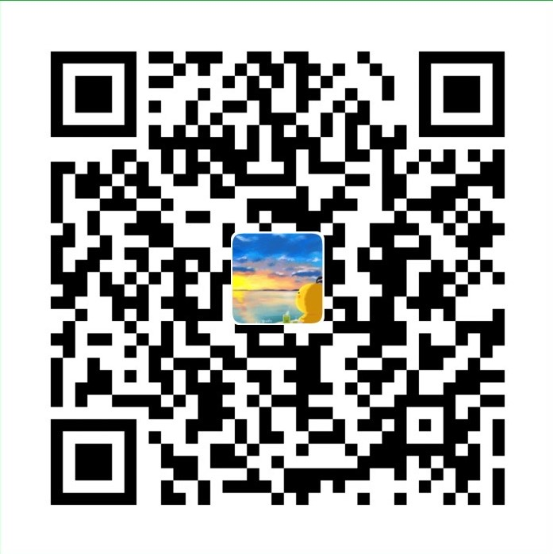

# :bookmark: VuePress 搭建个人静态博客网站

## :car: 环境

- VuePress
- Node 8+
- Yarn
基于VuePress搭建的个人网站，享受 Vue + webpack 的开发体验。

## 简述

记录在不断地学习过程中所记录的笔记

## :star: Find Me

| :four_leaf_clover:csdn博客 | [博客 Home](https://blog.csdn.net/m0_37903882)              |
| -------------------------- | ----------------------------------------------------------- |
| :car:掘金                  | [掘金Home](https://juejin.im/user/5aa1029c51882555770c0603) |
| :apple:简书                | [简书Home](https://www.jianshu.com/u/6740c2a5866d)          |
| :beer: ​Github              | [GitHub Home](https://github.com/DuebassLei)                |
| :bird:码云                 | [Gitee码云](https://gitee.com/DuebassLei)                   |

:smile: [海边的小溪鱼个人网站](https://duebasslei.gitee.io/)

:email: 1130122701@qq.com

## 说明

>VuePress 搭建个人博客源码仓库

## 如果觉得文章不错，请我吃颗棒棒糖吧~~

