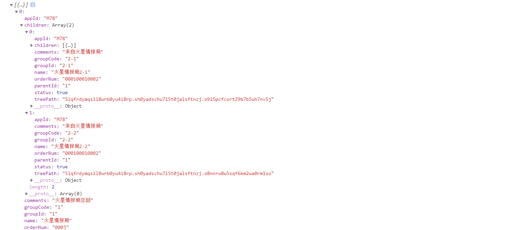
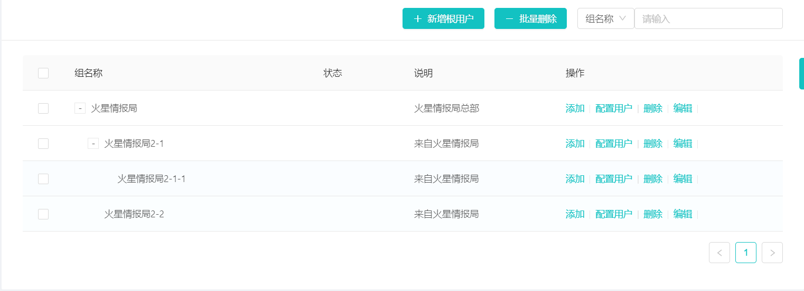

# :bookmark: Array 转 Tree(平铺结构转树形层级结构)
## 需求
>从后端接口获取数据，将List<T>集合以Json形式返回，返回数据形如下所示，现为了前端以树形结构展示，需将一维数据转化为树形结构。

```json
[
          {
            'groupId': '1',
            'appId': 'M78',
            'groupCode': '1',
            'parentId': 0,
            'name': '火星情报局',
            'treePath': 'gSLWUyPnLu',
            'orderNum': '0003',
            'status': true,
            'comments': '火星情报局总部'
          },
          {

            'groupId': '2-1',
            'appId': 'M78',
            'groupCode': '2-1',
            'parentId': '1',
            'name': '火星情报局2-1',
            'treePath': '5lqfrdymqsll8wrb0yu4i8rp.sh0yadschu7l5t0jalsftnzj.o9i5pcfcort29b7b5uh7nv5j',
            'orderNum': '000100010002',
            'status': true,
            'comments': '来自火星情报局'
          },
          {
            'groupId': '2-2',
            'appId': 'M78',
            'groupCode': '2-2',
            'parentId': '1',
            'name': '火星情报局2-2',
            'treePath': '5lqfrdymqsll8wrb0yu4i8rp.sh0yadschu7l5t0jalsftnzj.o8nnru8w5sqf6km2wa0rm1so',
            'orderNum': '000100010002',
            'status': true,
            'comments': '来自火星情报局'
          },
          {
            'groupId': '2-1-1',
            'appId': 'M78',
            'groupCode': '4',
            'parentId': '2-1',
            'name': '火星情报局2-1-1',
            'treePath': '5lqfrdymqsll8wrb0yu4i8rp.nqkskjl03rg78rb5k5okfpm2',
            'orderNum': '00010001',
            'status': true,
            'comments': '来自火星情报局'
          }
]
```
## 主要逻辑
调整以下两个参数对应相应数据参数，即可

- ${parentId}  父ID
- ${groupId}   ID

```javascript
 arrayConvertTree (list = []) {
      const data = JSON.parse(JSON.stringify(list)) 
      const result = []
      if (!Array.isArray(data)) {
        return result
      }
      data.forEach(item => {
        delete item.children
      })
      const map = {}
      data.forEach(item => {
        map[item.groupId] = item
      })
      data.forEach(item => {
        const parent = map[item.parentId]
        if (parent) {
          (parent.children || (parent.children = [])).push(item)
        } else {
          result.push(item)
        }
      })
      return result
    }
```
## 测试

```javascript
const tree = this.arrayConvertTree(dataSource) // dataSource 为后端获取的jsonArray数据
console.log(tree)
```


至此，已成功将 Array 转为 Tree。

## 效果
> 前端使用的是 Ant-Design-Vue 中的 Table 组件



```javascript
<template>
  <a-card
    :bordered="false"
  >
    <div slot="extra">
      <a-button type="primary" @click="handleGroupList"><a-icon type="plus" />新增根用户</a-button>
      <a-button type="primary" style="margin-left: 15px;"><a-icon type="minus" />批量删除</a-button>
      <a-select defaultValue="name" @change="handleChange" style="margin-left: 16px; ">
        <a-select-option value="dept">部门</a-select-option>
        <a-select-option value="other">其他</a-select-option>
        <a-select-option value="name">组名称</a-select-option>
      </a-select>
      <a-input style="width: 225px;" placeholder="请输入"/>
    </div>
    <a-table :columns="columns" :dataSource="data" :rowSelection="rowSelection" >
      <span slot="serial" slot-scope="text, record, index">
        {{ index + 1 }}
      </span>
      <span slot="status" slot-scope="text">
        <a-badge :status="text | statusTypeFilter" :text="text | statusFilter" />
      </span>

      <span slot="action" slot-scope="text, record">
        <template>
          <a @click="handleAdd(record)">添加</a>
          <a-divider type="vertical" />
          <a @click="handleSetUser(record)">配置用户</a>
          <a-divider type="vertical" />
          <a @click="handleDel(record)">删除</a>
          <a-divider type="vertical" />
          <a @click="handleEdit(record)">编辑</a>
          <a-divider type="vertical" />
        </template>
      </span>
    </a-table>
  </a-card>
</template>
<script>
const columns = [
  {
    title: '组名称',
    dataIndex: 'name',
    key: 'name'
  },
  {
    title: '状态',
    dataIndex: 'status',
    key: 'status',
    width: '12%'
    // scopedSlots: { customRender: 'status' }
  }, {
    title: '说明',
    dataIndex: 'comments',
    width: '20%',
    key: 'comments'
  },
  {
    title: '操作',
    dataIndex: 'action',
    width: '30%',
    key: 'action',
    scopedSlots: { customRender: 'action' }
  }]
const rowSelection = {
  onChange: (selectedRowKeys, selectedRows) => {
    console.log(`selectedRowKeys: ${selectedRowKeys}`, 'selectedRows: ', selectedRows)
  },
  onSelect: (record, selected, selectedRows) => {
    console.log(record, selected, selectedRows)
  },
  onSelectAll: (selected, selectedRows, changeRows) => {
    console.log(selected, selectedRows, changeRows)
  }
}

export default {
  data () {
    return {
      data: [],
      columns,
      rowSelection,
      dataSource: '',
      result: [],
      temp: []
    }
  },
  methods: {
    initGroupList () {
      const datas =  JsonData //上方给出的Json数据
      this.data = this.arrayConvertTree(datas)
    },
    handleGroupList () {
    },
    // Array 转 Tree 核心算法函数arrayConvertTree()
    arrayConvertTree (list = []) {
      const data = JSON.parse(JSON.stringify(list)) // 浅拷贝不改变源数据
      const result = []
      if (!Array.isArray(data)) {
        return result
      }
      data.forEach(item => {
        delete item.children
      })
      const map = {}
      data.forEach(item => {
        map[item.groupId] = item
      })
      data.forEach(item => {
        const parent = map[item.parentId]
        if (parent) {
          (parent.children || (parent.children = [])).push(item)
        } else {
          result.push(item)
        }
      })
      return result
    }
  },
  mounted () {
    this.initGroupList()
  }
}
</script>
```

